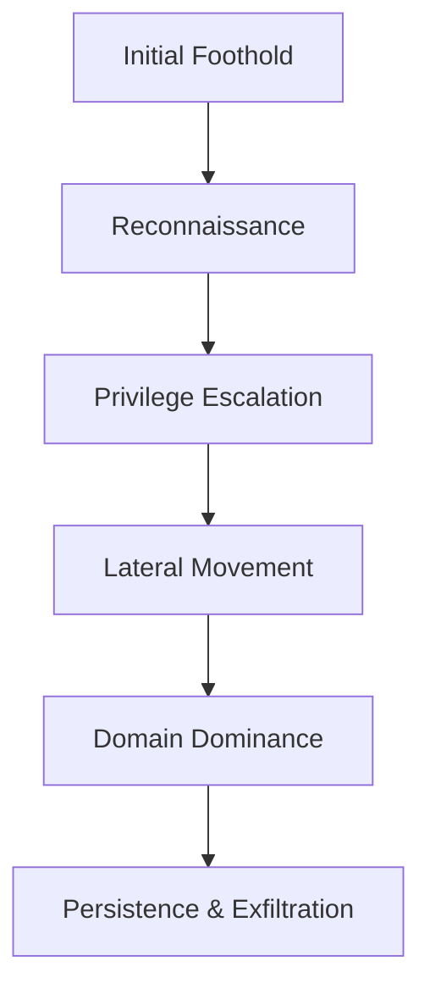

# Chapter 1: Introduction to Active Directory Security

## What is Active Directory?

Active Directory (AD) is Microsoft's proprietary directory service, introduced in Windows 2000 Server. It serves as the central authentication and authorization system for Windows domain networks. AD stores information about all users, computers, groups, and other resources within a network, providing a unified management point for administrators [1].

In modern enterprise environments, Active Directory Domain Services (AD DS) is the cornerstone of identity management. It uses a hierarchical structure to organize resources and applies security policies (Group Policy) centrally. For an attacker, compromising Active Directory is often the ultimate goal, as it provides full control over the network, all user identities, and the underlying infrastructure.

## History and Evolution

Active Directory has evolved significantly since its inception:
- **Windows 2000**: Introduced the LDAP-based directory service, replacing the legacy NT4 domain model.
- **Windows Server 2003/2008**: Added Group Policy enhancements, Read-Only Domain Controllers (RODCs), and fine-grained password policies.
- **Windows Server 2012/2016**: Introduced Protected Users group, Kerberos armoring, and Credential Guard.
- **Windows Server 2019/2022**: Focus on security hardening, Azure AD hybrid identity integration, and advanced threat protection [2].

## Enterprise Environments and Domain Security

In a typical enterprise, AD is not just a directory; it is the trust boundary. If an attacker gains Domain Admin (DA) privileges, they effectively own the entire environment. 

Key components of domain security include:
- **Authentication Protocols**: Kerberos (default) and NTLM (legacy fallback).
- **Access Control**: Discretionary Access Control Lists (DACLs) and System Access Control Lists (SACLs) on AD objects.
- **Policies**: Group Policy Objects (GPOs) that enforce password complexity, account lockout, and software restrictions.

## The Threat Landscape

The threat landscape for Active Directory has shifted from simple password guessing to sophisticated, multi-stage attacks leveraging protocol weaknesses and misconfigurations. Modern ransomware gangs and Advanced Persistent Threats (APTs) use AD attacks as their primary mechanism for lateral movement and privilege escalation.

Common threats include:
- **Credential Theft**: Extracting hashes from memory (LSASS) or disk (SAM, NTDS.dit).
- **Protocol Abuse**: Manipulating Kerberos tickets (Golden Ticket) or relaying NTLM hashes.
- **Misconfiguration Exploitation**: Abusing weak ACLs, unconstrained delegation, or vulnerable Certificate Services (AD CS).

## Attack Lifecycle

Understanding the attack lifecycle is crucial for both attackers (Red Team) and defenders (Blue Team). The typical AD attack lifecycle follows these stages:

1. **Initial Foothold**: Gaining access to a user workstation (e.g., phishing, physical access).
2. **Reconnaissance (Enumeration)**: Mapping the domain, finding users, groups, and computers.
3. **Privilege Escalation**: Moving from a standard user to a privileged account (e.g., local admin, service account).
4. **Lateral Movement**: Moving across the network to reach critical servers.
5. **Domain Dominance**: Compromising the Domain Controller (DC).
6. **Persistence**: Establishing backdoors (e.g., Golden Tickets) to maintain access.

## Common Terminology

| Term | Description |
|------|-------------|
| **Domain** | A logical group of network objects (users, computers, devices) that share the same AD database. |
| **Forest** | The top-level container in an AD network that holds one or more domains. |
| **Domain Controller (DC)** | A server that responds to security authentication requests (logging in, checking permissions) within a Windows domain. |
| **Organizational Unit (OU)** | A container used to organize users, groups, and computers within a domain. |
| **Group Policy Object (GPO)** | A collection of settings that define how programs, network resources, and the operating system work for users and computers in an organization. |
| **Kerberos** | The default authentication protocol in Windows AD, using tickets instead of sending passwords over the network. |
| **NTLM** | A legacy authentication protocol still present for backward compatibility, often targeted by attackers. |
| **SPN (Service Principal Name)** | The name that identifies an instance of a service, used by Kerberos. |

## Red Team vs. Internal Pentest

While the techniques overlap, the mindset differs:

- **Internal Penetration Test**: Focuses on identifying and reporting vulnerabilities. The goal is to demonstrate risk, often stopping after gaining Domain Admin access to prove impact. It is usually time-constrained and aims to fix specific issues.
- **Red Team Operation**: Focuses on simulating a realistic threat actor. The goal is to test the organization's detection and response capabilities. Red teams use custom tools, operate stealthily, avoid triggering alerts, and may maintain persistence for weeks or months.

## Lab Setup and Learning Path

To practice AD attacks safely, you must build your own lab environment. Never test these techniques on production networks without explicit permission.

**Recommended Lab Setup:**
- **Virtualization**: VMware Workstation or VirtualBox.
- **Domain Controller**: Windows Server 2019/2022 with AD DS installed.
- **Clients**: Windows 10/11 machines joined to the domain.
- **Attack Machine**: Kali Linux or Windows 10/11 with security tools (Mimikatz, BloodHound, Impacket, Rubeus) installed.

**Learning Path:**
1. Master the basics of Windows networking and AD architecture.
2. Learn PowerShell and basic C# for tool development.
3. Understand Kerberos and NTLM authentication flows deeply.
4. Practice enumeration and credential dumping.
5. Advance to protocol abuse and delegation attacks.

## References

[1] Microsoft Learn. "Active Directory Domain Services Overview." https://learn.microsoft.com/en-us/windows-server/identity/ad-ds/active-directory-domain-services
[2] Microsoft Learn. "Windows Server 2022 Security Features." https://learn.microsoft.com/en-us/windows-server/security/security-and-assurance
